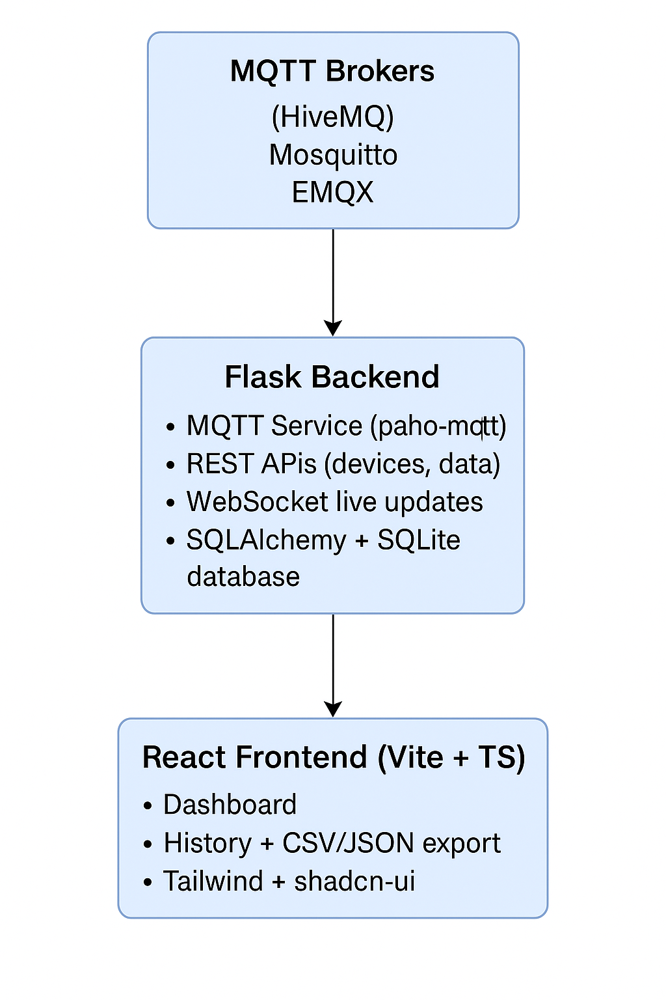

# 🛰️ Franc Automation Dashboard

[](https://flask.palletsprojects.com/)
[](https://react.dev/)
[](https://www.sqlite.org/)
[](https://www.docker.com/)
[](LICENSE)

> 🚀 An intelligent IoT dashboard for real-time device monitoring, MQTT streaming, and 7-day history — built with Flask, React, Tailwind CSS, and Docker.

---

## Project Overview

Franc Automation Dashboard is a full-stack IoT solution for real-time monitoring, device management, historical data retention (7-day rolling), and data export (CSV/JSON/ZIP). It targets industrial IoT use cases with a responsive UI and lightweight local storage.

Key components:
- Flask backend (APIs, MQTT ingestion, WebSockets)
- React + Vite frontend (live UI, charts)
- SQLite for storage
- Docker Compose for deployment

---

## Features

- Real-time MQTT sensor readings (temperature, humidity, pressure)
- Live dashboard visualization with WebSockets
- Device CRUD and management
- 7-day auto-rotating history
- CSV / JSON / ZIP export endpoints
- Responsive UI with Tailwind CSS + shadcn UI
- Dockerized deployment

---

## Architecture



---

## Tech Stack

Frontend
- React 18, TypeScript, Vite
- Tailwind CSS, shadcn UI, Framer Motion, Recharts
- Socket.IO client, React Router

Backend
- Python 3, Flask, Flask-SocketIO
- SQLAlchemy, SQLite, Paho-MQTT, Eventlet
- JWT authentication

DevOps
- Docker, Docker Compose, Git

---

## Local Setup

### Backend (Python)

> Requires Python 3.8+

```bash
cd backend
python -m venv .venv

# Activate the virtualenv
# macOS / Linux
source .venv/bin/activate
# Windows (PowerShell)
.venv\Scripts\Activate.ps1
# Windows (cmd)
.venv\Scripts\activate.bat

pip install -r requirements.txt

# run the app (option 1: module)
python -m backend.app
# or (option 2: flask CLI)
# export FLASK_APP=backend.app   # use set FLASK_APP=backend.app on Windows
# flask run --reload

# Backend default: http://127.0.0.1:5000
```

### Frontend

```bash
cd frontend
npm install
# or for reproducible installs: npm ci
npm run dev

# Frontend default: http://localhost:5173
```

### Docker (recommended)

```bash
# build and run in foreground
docker-compose up --build

# run detached
docker-compose up -d --build

# stop & remove containers
docker-compose down
```

Notes:
- Use environment files (.env) or compose overrides for production credentials.
- Ensure ports 5000 and 5173 are free or adjust docker-compose/network settings as needed.

## API Endpoints (examples)

- GET `/api/data/latest` — Latest sensor reading  
- GET `/api/devices` — List devices  
- GET `/api/history` — Last 7 days history  
- GET `/api/history/download/<date>` — JSON/CSV export for a date  
- GET `/api/history/download/last7.zip` — Full 7-day ZIP export

---

## Example Sensor Payload

```json
{
  "device_id": 1,
  "temperature": 28.7,
  "humidity": 65.3,
  "pressure": 1013,
  "timestamp": "2025-11-10T16:00:54"
}
```

---

## Status & Roadmap

Status: Stable — real-time MQTT, history, and exports tested.

Completed
- Real-time streaming, MQTT simulator, RBAC basics, responsive UI, Device CRUD

In Progress
- Historical analytics, dashboard builder, UI refinements

Planned / Future
- Alerts & notifications, multi-broker support, mobile app, AI anomaly detection, cloud & multi-tenant deployments

---

## Useful Commands

Frontend
```bash
npm run dev
npm run build
```

Backend
```bash
flask db migrate
flask db upgrade
```

Docker
```bash
docker-compose restart
docker logs francauto-app
```

---

## Author

Designed & developed by Jeffrin M. — Franc-Automation Development Team
