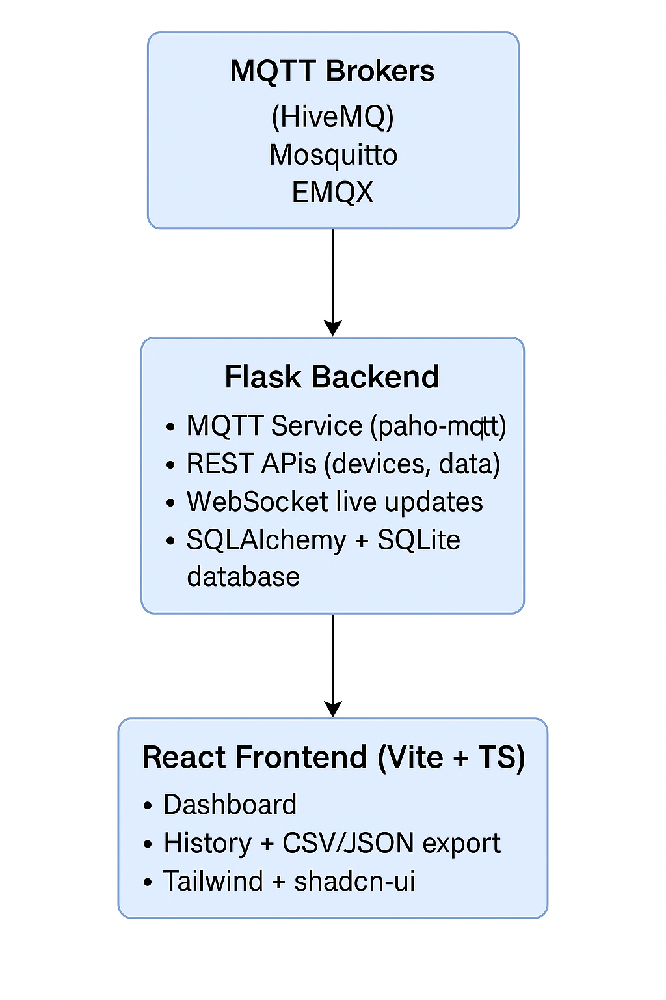

<<<<<<< HEAD
<<<<<<< HEAD
# Welcome to your Lovable project

## Project info

**URL**: https://lovable.dev/projects/e177de5c-f90a-4f49-94da-73b2c69cbad5

## How can I edit this code?

There are several ways of editing your application.

**Use Lovable**

Simply visit the [Lovable Project](https://lovable.dev/projects/e177de5c-f90a-4f49-94da-73b2c69cbad5) and start prompting.

Changes made via Lovable will be committed automatically to this repo.

**Use your preferred IDE**

If you want to work locally using your own IDE, you can clone this repo and push changes. Pushed changes will also be reflected in Lovable.

The only requirement is having Node.js & npm installed - [install with nvm](https://github.com/nvm-sh/nvm#installing-and-updating)

Follow these steps:

```sh
# Step 1: Clone the repository using the project's Git URL.
git clone <YOUR_GIT_URL>

# Step 2: Navigate to the project directory.
cd <YOUR_PROJECT_NAME>

# Step 3: Install the necessary dependencies.
npm i

# Step 4: Start the development server with auto-reloading and an instant preview.
npm run dev
```

**Edit a file directly in GitHub**

- Navigate to the desired file(s).
- Click the "Edit" button (pencil icon) at the top right of the file view.
- Make your changes and commit the changes.

**Use GitHub Codespaces**

- Navigate to the main page of your repository.
- Click on the "Code" button (green button) near the top right.
- Select the "Codespaces" tab.
- Click on "New codespace" to launch a new Codespace environment.
- Edit files directly within the Codespace and commit and push your changes once you're done.

## What technologies are used for this project?

This project is built with:

- Vite
- TypeScript
- React
- shadcn-ui
- Tailwind CSS

## How can I deploy this project?

Simply open [Lovable](https://lovable.dev/projects/e177de5c-f90a-4f49-94da-73b2c69cbad5) and click on Share -> Publish.

## Can I connect a custom domain to my Lovable project?

Yes, you can!

To connect a domain, navigate to Project > Settings > Domains and click Connect Domain.

Read more here: [Setting up a custom domain](https://docs.lovable.dev/tips-tricks/custom-domain#step-by-step-guide)


# Franc-Automation
5a66a203dccbb3ffa70277c159515104fc94187e

# 🛰️ Franc Automation Dashboard

[](https://flask.palletsprojects.com/)
[](https://react.dev/)
[](https://www.sqlite.org/)
[](https://www.docker.com/)
[](LICENSE)

> 🚀 *An intelligent IoT-based automation dashboard for real-time device monitoring, MQTT data streaming, and 7-day history tracking — built using Flask, React, Tailwind CSS, and Docker.*

---

# 🛰️ Franc Automation Dashboard

A full-stack IoT automation dashboard for real-time device monitoring, MQTT data streaming, historical data management, and data export.  
Built using **Flask (Python)**, **React + Vite**, **Tailwind CSS**, and **Docker**.

---

## 📘 Project Overview

Franc Automation Dashboard provides:

- Real-time MQTT sensor readings  
- Live dashboard visualization  
- Device management  
- 7-day history with automatic rotation  
- CSV / JSON / ZIP data export  
- Responsive UI for industrial IoT environments  

This system includes:

- **Flask Backend** – APIs, MQTT ingestion, WebSockets  
- **React Frontend** – Live UI, history, charts  
- **SQLite Database** – Lightweight local storage  
- **Docker Compose** – Simplified deployment  

---

## ✨ Features

| Category | Description |
|----------|-------------|
| 🌐 Real-time Monitoring | MQTT sensor readings (temperature, humidity, pressure) |
| ⚙️ Device Management | Add/manage connected IoT devices |
| 📊 Dashboard | Real-time visualization with live updates |
| 🕒 History | Auto-managed 7-day rolling history |
| 💾 Export | JSON / CSV / ZIP download options |
| 🎨 UI | Tailwind CSS + shadcn UI |
| 🐳 Deployment | Dockerized backend & frontend |

---

## 🧩 System Architecture



## ⚙️ Tech Stack

### **Frontend**
- React (Vite + TypeScript)  
- Tailwind CSS  
- shadcn-ui  
- Socket.IO client  

### **Backend**
- Flask (Python)  
- SQLAlchemy ORM  
- SQLite  
- paho-mqtt  
- Flask-SocketIO  
- Eventlet  

### **DevOps**
- Docker & Docker Compose  
- ngrok (optional)

---

## 🖥️ Local Setup

### **Backend Setup**

cd backend
python -m venv venv
venv\Scripts\activate
pip install -r requirements.txt
python -m backend.app
Backend runs at:
http://127.0.0.1:5000

Frontend Setup

cd frontend
npm install
npm run dev
Frontend runs at:
http://localhost:5173

🐳 Docker Setup (Recommended)

docker-compose up --build

📡 API Endpoints

Endpoint	Method	Description
/api/data/latest	GET	Latest sensor reading
/api/devices	GET	List all devices
/api/history	GET	Last 7 days history
/api/history/download/<date>	GET	JSON/CSV export
/api/history/download/last7.zip	GET	Full 7-day ZIP export

📊 Example Sensor Data

{
  "device_id": 1,
  "temperature": 28.7,
  "humidity": 65.3,
  "pressure": 1013,
  "timestamp": "2025-11-10T16:00:54"
}

🏁 Project Status

✔ Stable & fully functional
✔ Real-time MQTT tested
✔ History + exports working